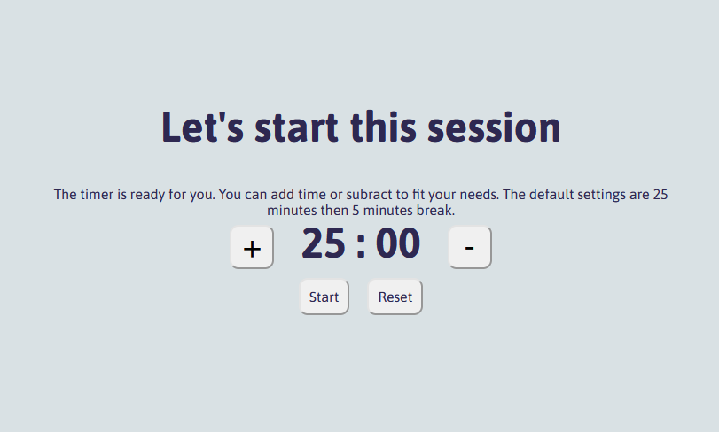

# Pomodoro Timer - a React Project 
### (Brief 9 *(The first app - Pomodoro timer*)

This project was created with [Create React App](https://github.com/facebook/create-react-app).

A timer for studying. 25 minutes countdown, then a alarm will sound, and the timer will change to break timer for 5 minutes, and then it goes back. This is how it looks like:

Feel free to test it out here on github pages.

This was the second react project I did, and this was the first time using react by myself. It was a lot of focus from my part to get into the mindset on how to create a react project an structure it, rather than designing it. So more focus on the logic!
